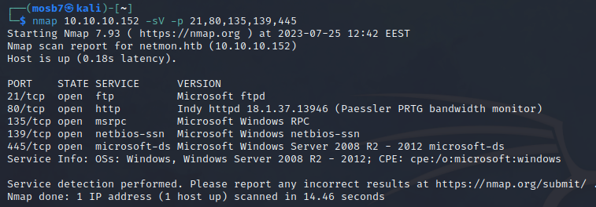
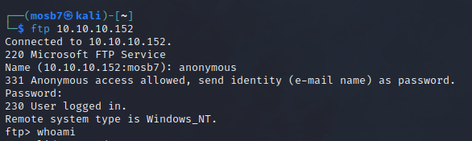
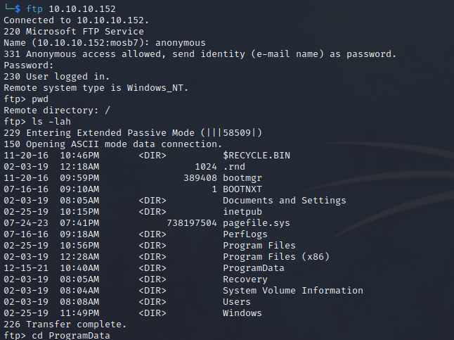
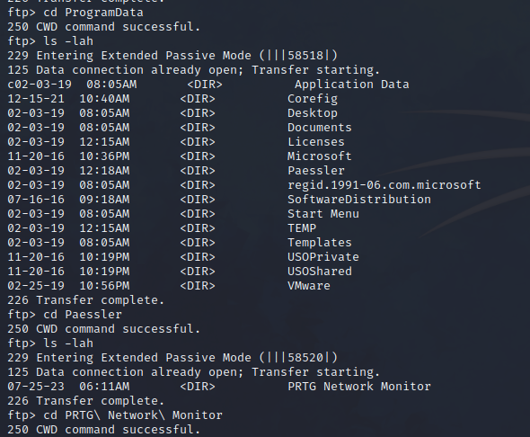
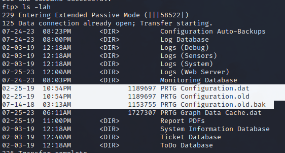
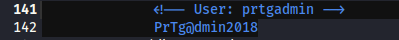
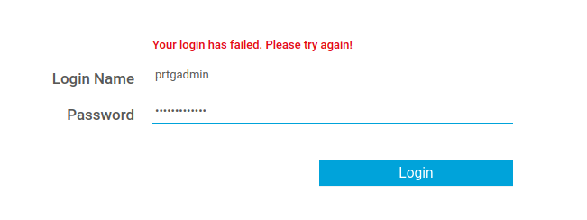
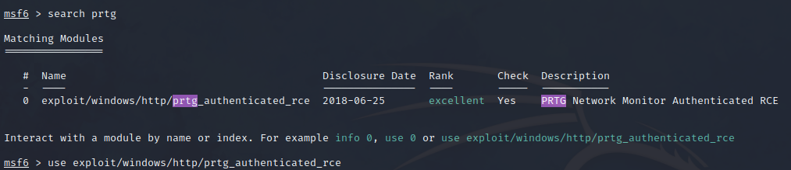
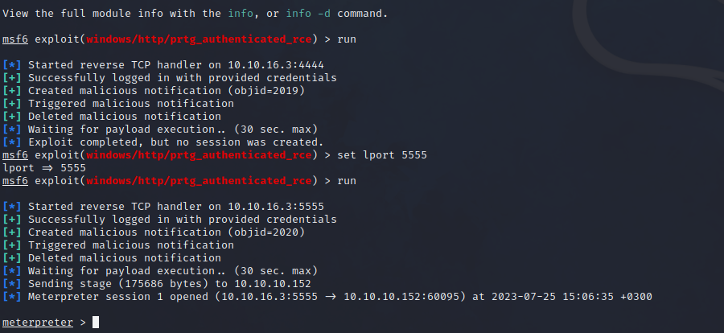
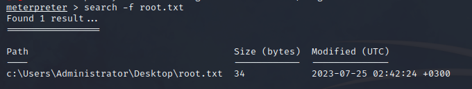

# netmon

let’s begin with nmap

ftp? let’s try anonymous access

nice.

here we can access user.txt

after opening the browser we found this network monitor tool with old version has RCE

so we will try get the credentials

after some searching we found

https://github.com/ch-rigu/CVE-2020-11547--PRTG-Network-Monitor-Information-Disclosure

[How and where does PRTG store its data? | Paessler Knowledge Base](https://kb.paessler.com/en/topic/463-how-and-where-does-prtg-store-its-data)

https://github.com/A1vinSmith/CVE-2018-9276

so we will try to get the backup files from the machine using ftp

after searching in PRTG Configuration.old.bak file

but we failed again

if we notice this password pattern let’s change to newer years

PrTg@dmin2018 ⇒ PrTg@dmin2019 worked

it’s CVE time

there is a module in metasploit

