at the first i used nmap

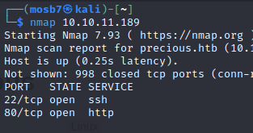

so let’s open it in the browser

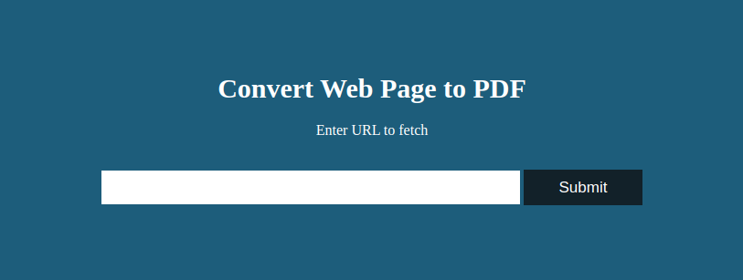

it’s a page which take a url then take screenshot then convert it to pdf file

let’s try the functionality and see what the file

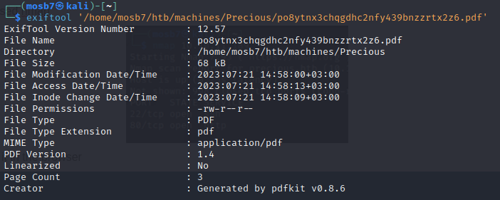

just search for CVE in the creator tool

and i found there command injection vulnerability

[Command Injection in pdfkit | CVE-2022-25765 | Snyk](https://security.snyk.io/vuln/SNYK-RUBY-PDFKIT-2869795)

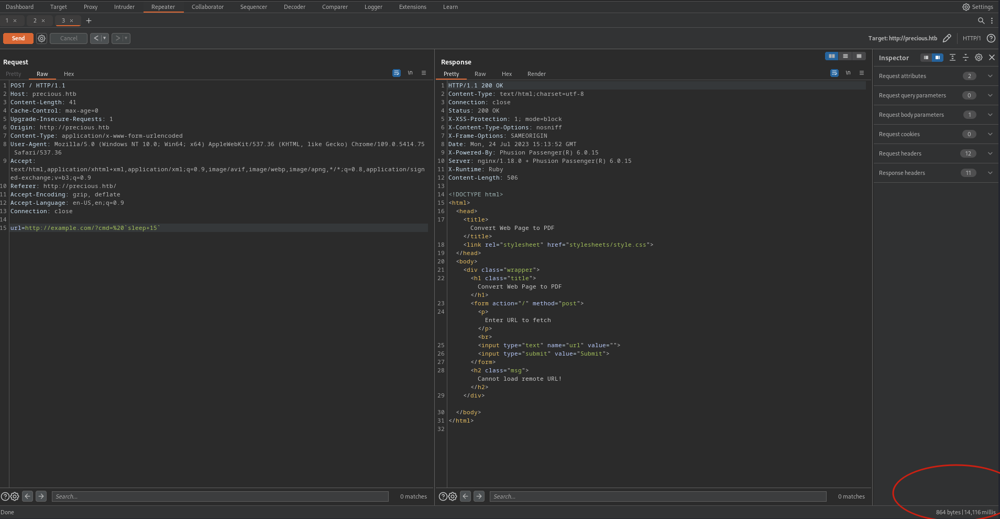

there is command injection

know we can make sure of it

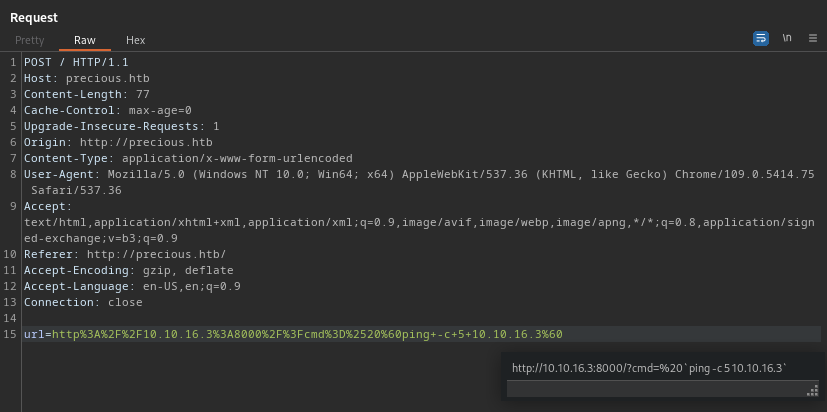

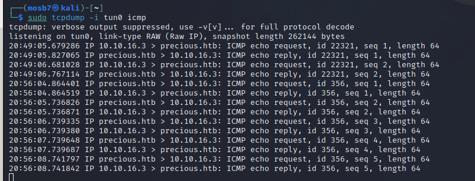

let’s make reverse shell

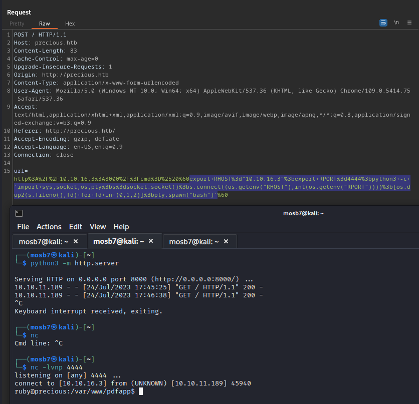

after some enumeration and searching we found this file in the user directory

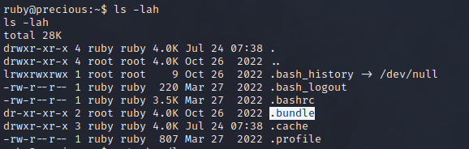

it’s a folder which has some configurations

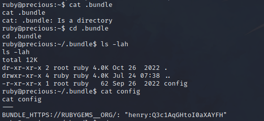

now how esclate

when we did some enumeration we found there ruby file can run with sudo without password

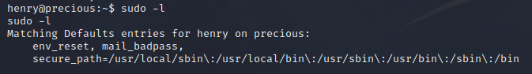

and when we run it and understand the file we found it do some updates from serialized YML file but the idea here , the file read *dependencies.yml* file from the current shell directory

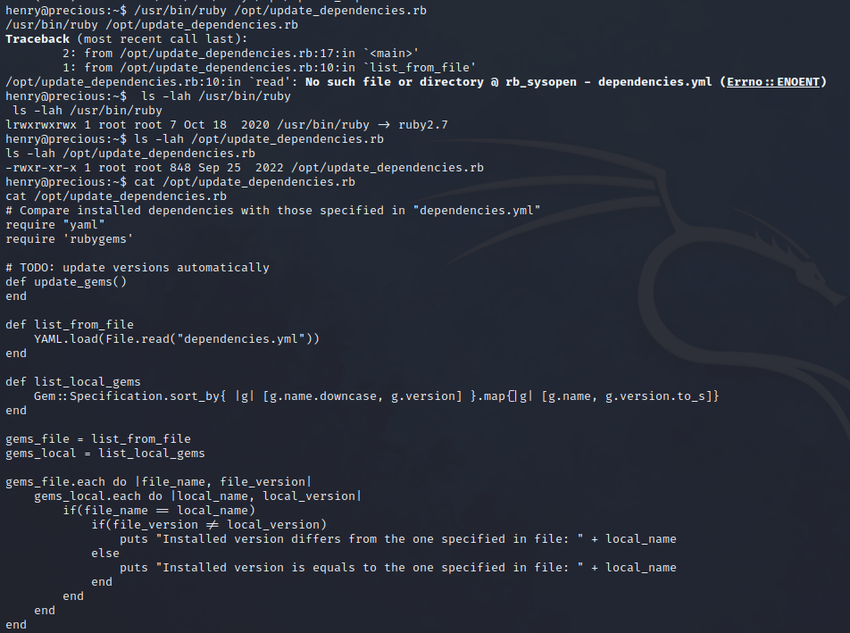

here we need to create this file then inject our payloads to it

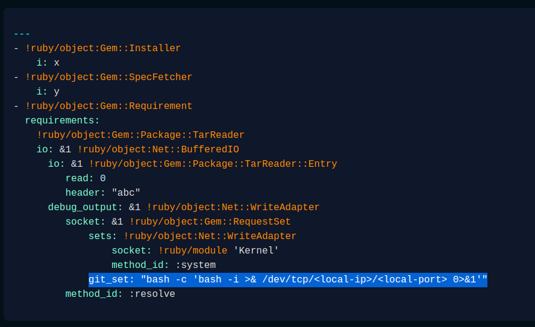

we can create this file in the ***tmp*** directory and open listner from our local machine

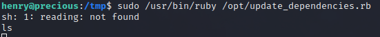

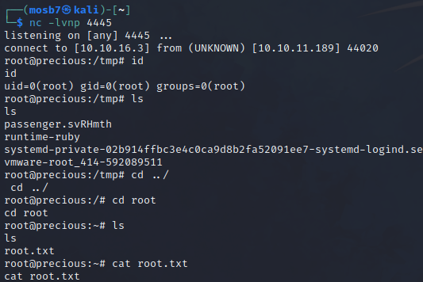
