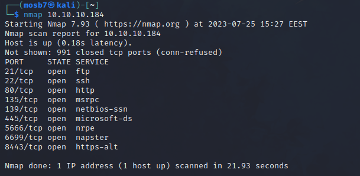
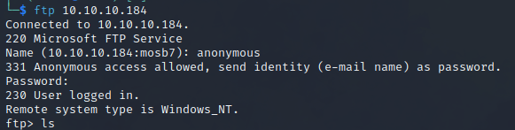
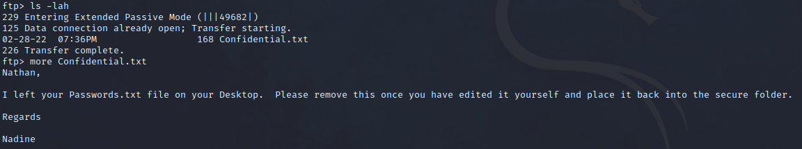
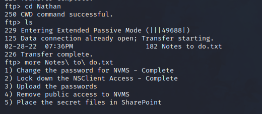
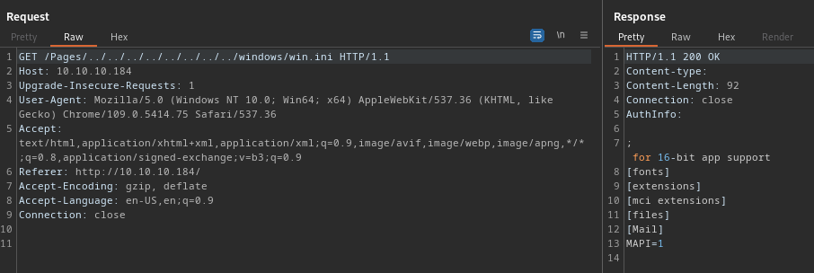
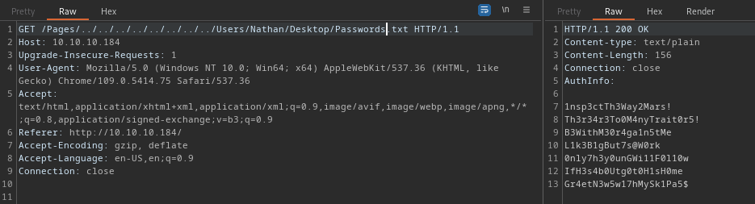
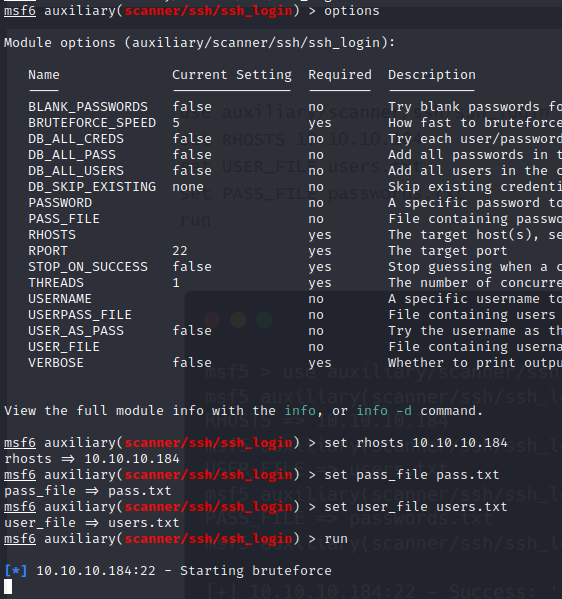

let’s start with nmap

FTP time

using anonymous user

with some searching

after open the ip http page we found this TVT NVMS 1000 which has directory traversal so let’s try nathan desktop

we get win.ini file so let’s go to */Users/Nathan/Desktop/Password.txt*

will try it in ssh

we will try password spray in ssh using metaploit

logged successfully with nadine and one pass of the previous